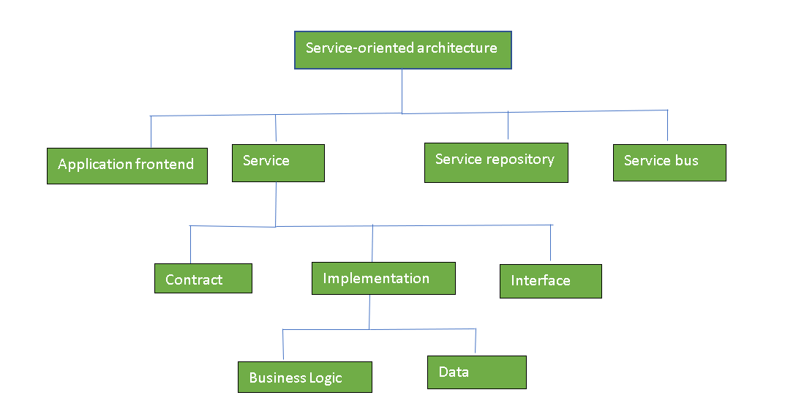
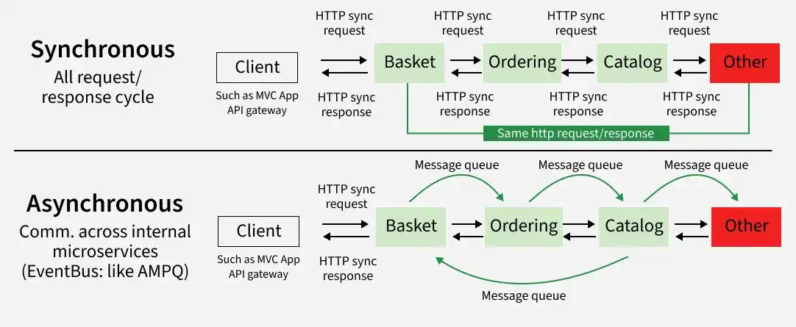

# 2.5 Service-Based Architecture Style

    **Contributed by:** Sonam Choki 
    **Student ID:** 02240361 
    **Date:** 16 May 2026  
    **Course:** SDA202

--- 

### Definition
Service-based architecture is a hybrid of the microservices architecture style and is considered one of the most pragmatic architectural patterns. It is often chosen for its balance between the agility of microservices and the simplicity of monolithic applications.

---

## 2.5.1 Topology Variants
The topology typically consists of a user interface, separately deployed services, and a database.

### Key Variants:
1. **Shared Database Variant:** Multiple services connect to a single, large database.
    * **Example:** A campus portal where the 'Library Service' and 'Canteen Service' both read from the same central 'Student Profile' database to verify identity.
2. **Partitioned Database Variant:** The database is split logically (different schemas) or physically (different servers) based on service domains.
3. **API Gateway Variant:** An API Gateway sits between the UI and services to handle routing, protocol translation, and security.

---

## 2.5.2 Service Design and Granularity
In this style, services are **coarse-grained**. Instead of splitting a system into hundreds of tiny pieces, it is split into a few large, logical domains.

* **Domain-Centric:** Services are grouped by business units (e.g., 'Inventory Service', 'Order Service').
* **Maintainability:** Larger services prevent the "distributed monolith" problem where small changes require updating many different services simultaneously.

---

## 2.5.3 Service Communication
How services interact is crucial for performance:
* **Synchronous (REST/gRPC):** One service calls another and waits for a response. This is common for "live" data needs.
* **Asynchronous (Messaging):** Services use a broker (like RabbitMQ) to send messages without waiting.
    * **Example:** After a user pays, the 'Payment Service' drops a message in a "queue." The 'Email Service' picks it up later to send the receipt.

---

## 2.5.4 Scaling and Performance
* **Targeted Scaling:** Unlike a monolith, you can scale only the services under high load.
    * **Real-World Case:** During exam registration, the 'Registration Service' can be scaled to 5 instances, while the 'Alumni Service' stays at 1 instance to save resources.
* **Efficient Performance:** Because services are coarse-grained, there are fewer "network hops" than in microservices, which speeds up request processing.

---

## 2.5.5 Fault Tolerance and Reliability
* **Fault Isolation:** If one service (e.g., 'Reporting') fails, the rest of the application (e.g., 'Login' or 'Transactions') continues to work.
* **Reliability:** Developers can implement "Circuit Breakers." If Service A sees Service B is failing, it stops trying to call it, preventing the whole system from slowing down.

---

## 2.5.6 Advantages and Disadvantages of Service-Based Architecture

Evaluating the trade-offs of this architecture style helps determine when it is the right choice for a system compared to a monolith or microservices.

| **Advantages** | **Disadvantages** |
| :--- | :--- |
| **Agility:** Faster deployment cycles and quicker feature releases than a traditional monolith. | **Increased Complexity:** More complex to monitor, test, and deploy than a single monolithic application. |
| **Manageability:** With fewer, larger services, it is much easier to maintain than 100+ tiny microservices. | **Database Bottlenecks:** If using a shared database variant, the database can easily become a single point of failure. |
| **Scalability:** Supports independent scaling of specific business domains based on demand. | **Data Integrity Challenges:** Moving to physical partitioning makes cross-service joins and maintaining ACID transactions difficult |

---

## 2.5.7 Real-World Applications
* **E-Commerce Platforms:** Managing separate services for 'Product Catalog', 'Cart', and 'Shipping'.
* **Banking Systems:** Separating 'Account Management' from 'Loan Processing' to ensure one doesn't affect the performance of the other.

---

## References & Further Reading
- [GeeksforGeeks: Service Oriented Architecture (SOA)](https://www.geeksforgeeks.org/service-oriented-architecture/)
- [GeeksforGeeks: Monolithic vs. Service-Oriented vs. Microservice Architecture](https://www.geeksforgeeks.org/system-design/monolithic-vs-service-oriented-vs-microservice-architecture/)
- [GeeksforGeeks: Database Partitioning Strategy](https://www.geeksforgeeks.org/system-design/data-partitioning-techniques/)